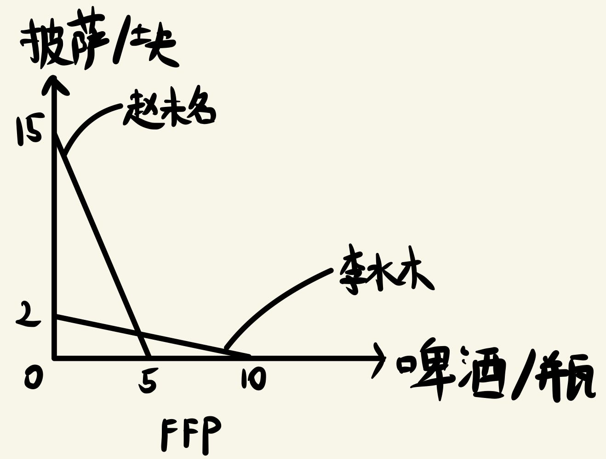
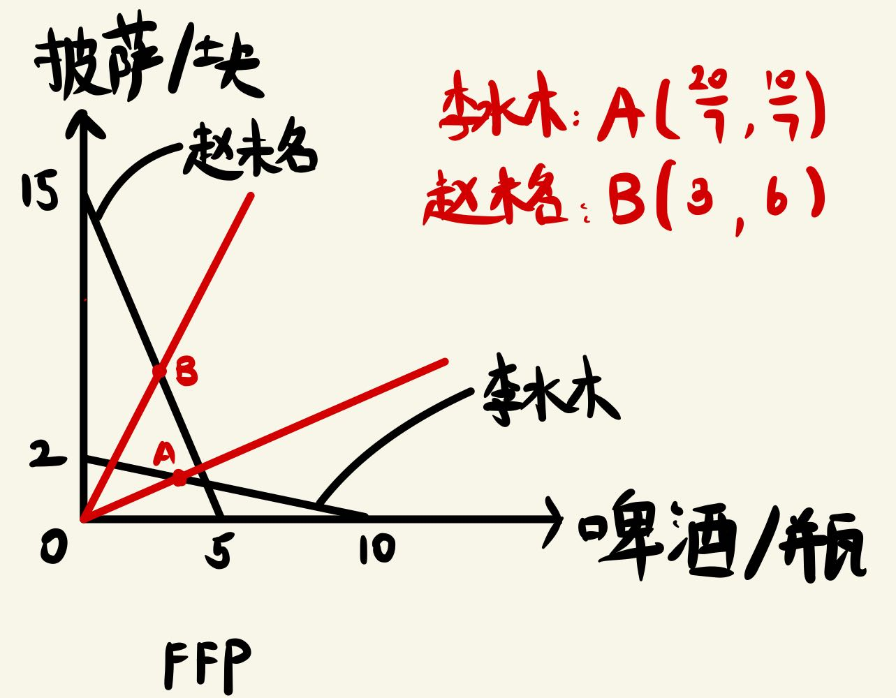
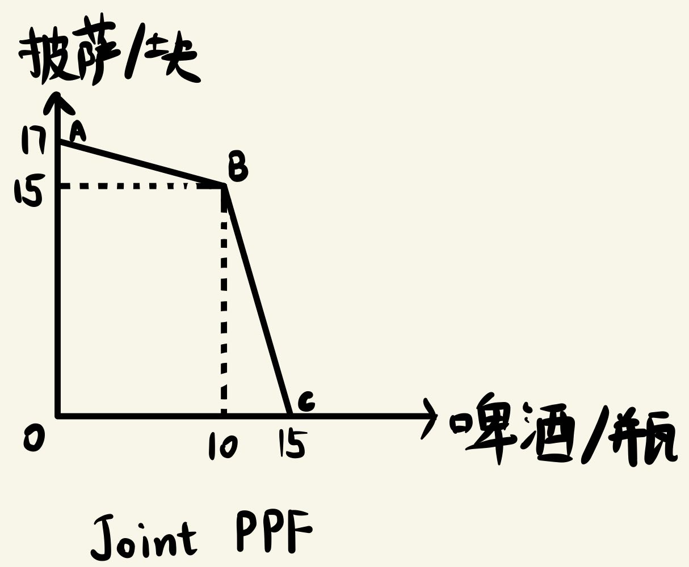
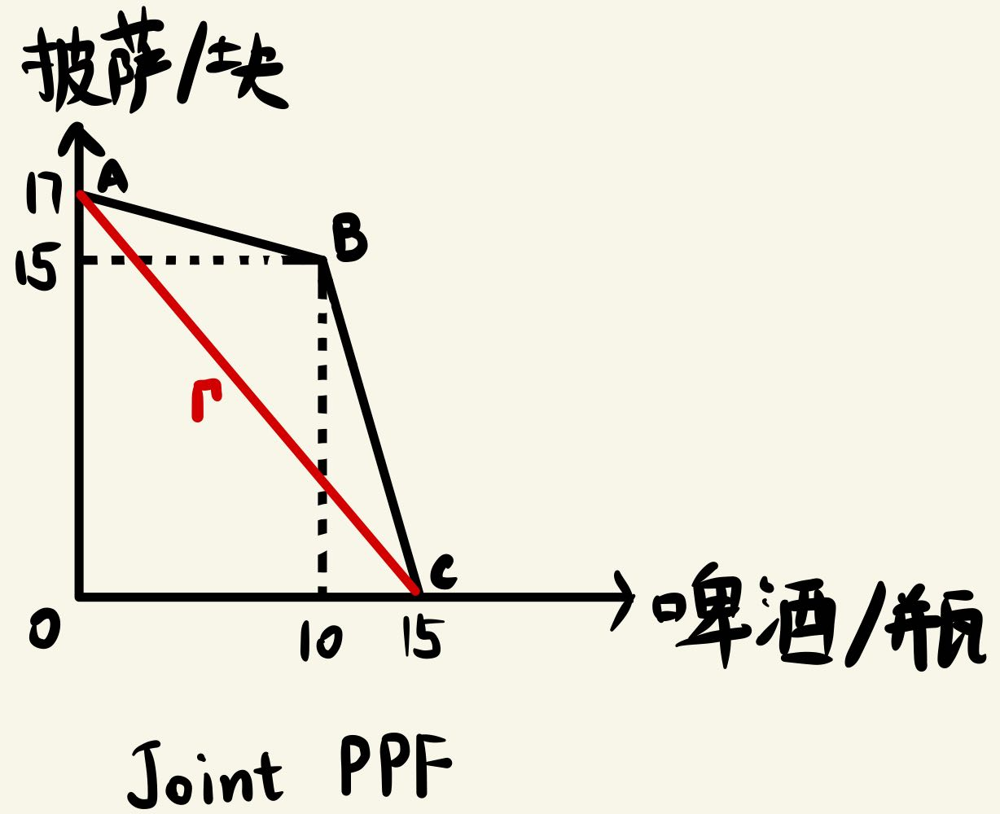

# 经济学原理第二次作业

梁昱桐 2100013116

## 一、理性人考虑边际

**1、试判断以下论述：水是生命所必须的，而钻石不是。因此，增加一杯水的边际收益大于增加一克拉钻石的边际收益。
要求：请先一般性地讨论这一论述正确与否。若有兴趣，可以进一步讨论个体差异（性别、富裕程度、教育背景等）对结论的影响。**

这个论述是错误的，一般来讲增加一杯水的边际收益远小于增加一克拉钻石的边际收益。

从结果出发，一般来讲每个人在面对一杯水和一克拉钻石的时候都会选择一克拉钻石，显然我们每一个人都喜欢边际价值更高的选择，这是因为每个人的支付意愿都取决于物品的边际价值，从而增加一杯水的边际收益小于增加一克拉钻石的边际收益。

本质上讲，增加一杯水的边际收益小于增加一克拉钻石的边际收益是由于钻石的稀缺性，我们每个人都可以拥有很多水，但是钻石非常稀少，这导致钻石的边际收益很高。

如果考虑个体差异，水和钻石对不同个体的价值显然是不同的，比如在干旱的地区，一杯水的价值肯定要远远高于平均水平；对于富裕的人，钻石作为奢侈品，其边际收益可能要下降

**2、当你修好电脑并提交经济学原理作业后，你的笔记本电脑在第二周再次显示器蓝屏，没有办法第一时间查看并完成第二次经济学原理的作业。你突然想起之前有台旧笔记本电脑可以使用，当你满怀希望开机之际，旧电脑也蓝屏。为此你感到十分绝望。你马上骑车将两台笔记本电脑送到中关村进行检查。店主告诉你为了能查看经济学原理的作业题，你需要对电脑主板的芯片进行更换，修好后你就可以尽情享受做作业的乐趣。新电脑维修的费用是 400 元，旧电脑由于零件较旧，很难调货，因此维修成本是 600 元。假定单独修好新电脑给你带来的收益是 1200 元，单独修好旧电脑给你带来的收益是 800 元。同时拥有两台电脑的收益是 1600 元。你应该维修一台电脑还是两台电脑？如果是一台，具体是哪一台？**

| 价格/元  | 维修新电脑 | 维修旧电脑 | 同时维修 |
| :------: | :--------: | :--------: | :------: |
|   收益   |    1200    |    800     |   1600   |
| 显性成本 |    400     |    600     |   1000   |
| 隐性成本 |    600     |    800     |   800    |
| 机会成本 |    1000    |    1400    |   1800   |
|  净收益  |    200     |    -600    |   -200   |

因此应该只维修新电脑

**3、在揣着钱包计算应该修理几台电脑的同时，你发现了让你小鹿乱撞的异性同班同学。你们是在经济学原理的课上认识的。碰巧，她/他也来修电脑。很不幸，店主经过检查告之其电脑的维修比较繁琐，需要花费一周的时间和较高的费用。你意识到如果修好手上两台电脑的话，你可以借一台给她/他解决燃眉之急。假定帮助她/他对你带来的收益是 250 元，你应该维修一台电脑还是两台电脑？如果是一台，具体是哪一台？
注：如果修好了两台电脑，即使借出一台，你依旧能够获得同时拥有两台电脑的收益，即 1600 元。**

| 价格/元  | 维修新电脑 | 维修旧电脑 | 同时维修并借给同学 |
| :------: | :--------: | :--------: | :----------------: |
|   收益   |    1200    |    800     |        1850        |
| 显性成本 |    400     |    600     |        1000        |
| 隐性成本 |    850     |    850     |        800         |
| 机会成本 |    1250    |    1450    |        1800        |
|  净收益  |    -50     |    -650    |         50         |

因此应该同时维修新旧电脑并借给同学

**4、在上一题的计算中，如果你是在向店主提交了维修新电脑的费用后才邂逅异性同班同学，你应该再对旧电脑进行维修么？**

| 价格/元  | 不维修旧电脑 | 维修旧电脑并给同学 |
| :------: | :----------: | :----------------: |
|   收益   |      0       |        650         |
| 显性成本 |      0       |        600         |
| 隐性成本 |      50      |         0          |
| 机会成本 |      50      |        600         |
|  净收益  |     -50      |         50         |

应该继续维修旧电脑（不如把新电脑给Ta这样异性同学或许会给你发好人卡？）

## 二、贸易

**1、假定世界上只有3个国家：美国、中国和沙特，每个国家均可生产3种产品：石油、纺织品和汽车。每个国家每年的生产要素全部用于生产一种产品时各自的产量如下表所示：**

|   年产量   | 石油（亿桶） | 纺织品（亿件） | 汽车（万辆） |
| :--------: | :----------: | :------------: | :----------: |
|    美国    |      2       |       10       |      50      |
|    中国    |      1       |       8        |      24      |
| 沙特阿拉伯 |      10      |       2        |      8       |

**根据比较优势理论，上述三个国家的比较优势分别是什么？为什么？**

|  机会成本  | 纺织品/石油 汽车/石油 | 石油/纺织品 汽车/纺织品 | 石油/汽车 纺织品/汽车 |
| :--------: | :----------------------: | :------------------------: | :----------------------: |
|    美国    |           5/25           |           0.2/5            |         0.04/0.2         |
|    中国    |           8/24           |          0.125/3           |       0.042/0.333        |
| 沙特阿拉伯 |         0.2/0.8          |            5/4             |        1.25/0.25         |

1. 考虑三国的石油在纺织品及汽车意义下的机会成本，可以得出沙特阿拉伯的石油总有最小的机会成本，因此沙特阿拉伯的石油有比较优势
2. 考虑三国纺织品在石油及汽车意义下的机会成本，可以得出中国的纺织品总有最小的机会成本，因此中国的纺织品有比较优势
3. 考虑三国汽车在石油及纺织品意义下的机会成本，可以得出美国的汽车总有最小的机会成本，因此美国的汽车有比较优势

**2、李水木和赵未名搁浅在一个荒芜的小岛上。岛上的原材料只适合生产啤酒和披萨，但是岛上的原材料是无穷无尽的，劳动力是唯一稀缺的要素。李水木和赵未名每人每天花 10 小时做啤酒或披萨，下表描述了李水木和赵未名每小时分别可以生产啤酒和披萨的数量。**
|  产量  |    啤酒     |    披萨     |
| :----: | :---------: | :---------: |
| 李水木 |  1 瓶/小时  | 0.2 块/小时 |
| 赵未名 | 0.5 瓶/小时 | 1.5 块/小时 |

**（1）请画出李水木和赵未名各自每日的生产可能性边界。**

**（2）李水木生产啤酒的机会成本（以披萨计）是多少？赵未名呢？**

李水木生产啤酒的机会成本=0.2块披萨/小时

赵未名生产啤酒的机会成本=3.0块披萨/小时

**（3）假设李水木和赵未名有如下偏好：李水木想以 2:1 的比例消费啤酒和披萨（即 2 瓶啤酒配 1 块披萨），赵未名想以 1:2 的比例消费啤酒和披萨（即 1 瓶啤酒配2 块披萨）。如果两人决定自给自足，那么李水木和赵未名每天分别可以享用多少啤酒和披萨？请在他们各自的生产可能性边界（PPF）上标记各自最终消费的组合。**

**（4）现假定两人决定合作，请画出他们的联合生产可能性边界（joint PPF）。这会是什么形状？为什么？**

这是外凸的折线，因为两人生产产品的机会成本不同，让生产产品的机会成本更低的人生产对应的产品，可以使得两人经济体的经济总产量增加。

A点两人只生产披萨

AB段啤酒需求量增加，李水木开始生产啤酒

B点李水木生产啤酒的生产要素被耗尽

BC段啤酒需求量过大，赵未名开始生产啤酒

C点两人只生产啤酒

**（5）请证明他们现在的状况比分别工作时更好。**

$\Gamma$为两人单独生产时的生产可能性边界，可以看出$\triangle ABC$为两人单独生产时的不可及区域，然而当两人分工合作时，$\triangle ABC$为可及的区域了，因此他们现在的状况比分别工作时更好，使经济总产量增加了。

**（6）假设李水木和赵未名分别住在小岛的两端，如果两人进行交易，产品在运输的过程中会产生 25%的损耗。给定（3）中的消费偏好，此时，贸易是否会使得双方变得更好？如果会，请举一个例子；如果不会，说明理由。**

直接举例子：

李水木生产10瓶啤酒；赵未名生产1瓶啤酒，12块披萨。

李水木给赵未名4瓶啤酒，赵未名给李水木4块披萨。

最后李水木有6瓶啤酒，3块披萨；赵未名有4瓶啤酒，8块披萨。

此时满足两人的消费偏好且双方获得的商品均多于自己生产的。

数学计算：

设某一情况下李水木经过交易获得$x_1$的啤酒，$y_1$的披萨；赵未名获得$x_2$的啤酒，$y_2$的披萨

经过交易，李水木给赵未名$m$的啤酒，赵未名给李水木$n$的披萨

根据两人的生产可能性边界：

$$
(x_1+m)+5(y_1-\frac{3}{4}n)=10
$$

$$
2(x_2-\frac{3}{4}m)+\frac{2}{3}(y_2+n)=10
$$

经过贸易后两人应该满足约束：

$$
\frac{x_1}{y_1}=\frac{2}{1}
$$

$$
\frac{x_2}{y_2}=\frac{1}{2}
$$

化简得：

$$
\frac{21}{4}x_1+\frac{10}{3}x_2=25+\frac{119}{24}n
$$

考虑到李水木获得的披萨不能大于他最终拥有的披萨：

$$
\frac{3}{4}n\leqslant y_1
$$

即：

$$
n\leqslant\frac{2}{3}x_1
$$

将$(7)$代入$(5)$：

$$
7x_1+12x_2\leqslant90
$$

将$x_1=\frac{20}{7}, x_2=3$代入$(8)$，发现小于号严格成立，因此存在使双方变得更好的贸易情况，不妨取（满足贸易使得双方变得更好）：

$$
\left\{
\begin{aligned}
x_1&=\frac{30}{7}\\
x_2&=5
\end{aligned}
\right.
$$

此时只需李水木生产$10$瓶啤酒；赵未名生产$\frac{5}{7}$瓶啤酒，$\frac{90}{7}$块披萨

同时经过交易，李水木给赵未名$\frac{40}{7}$的啤酒，赵未名给李水木$\frac{20}{7}$披萨

此时满足两人的生产可能性边界，贸易使得双方变得更好
