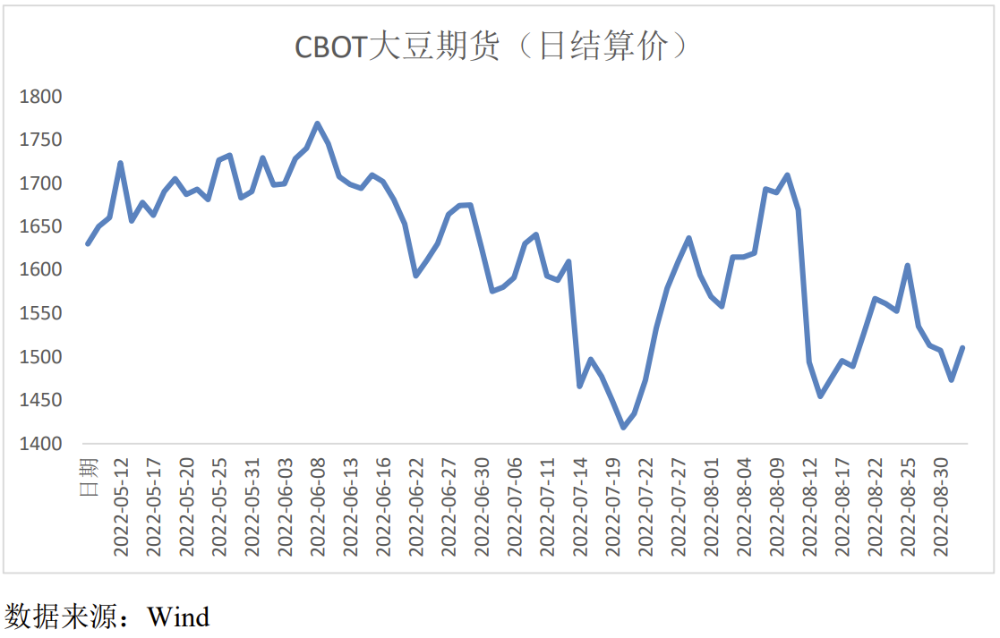
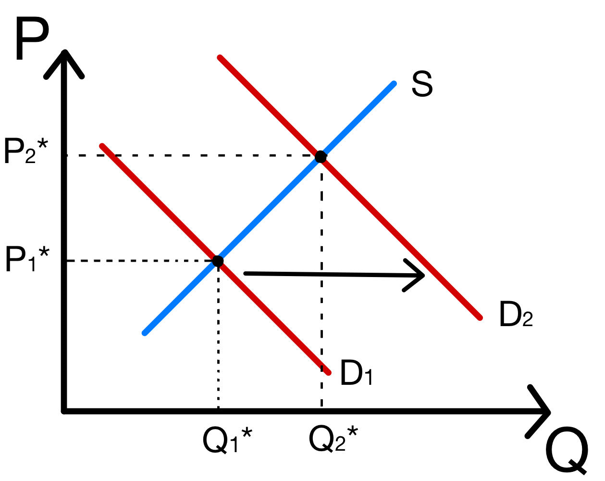
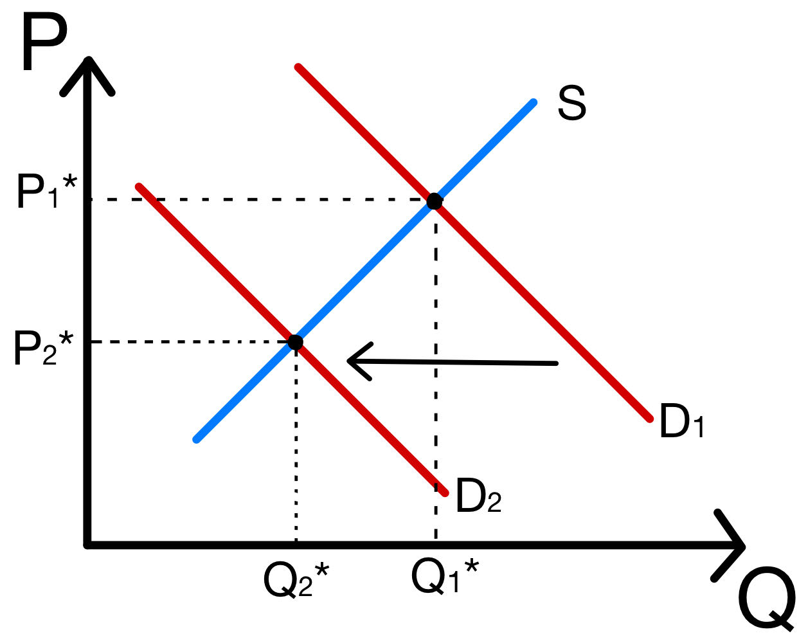
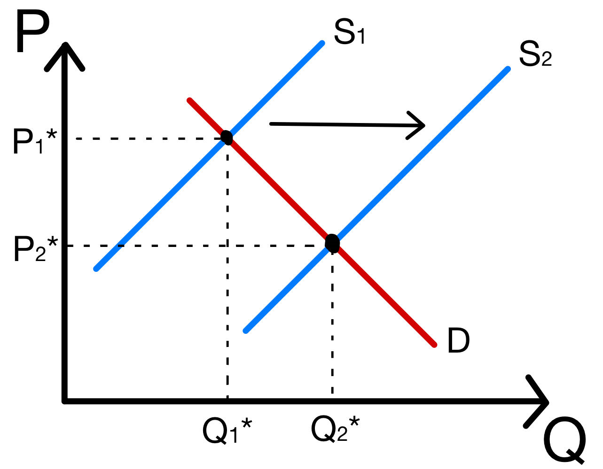
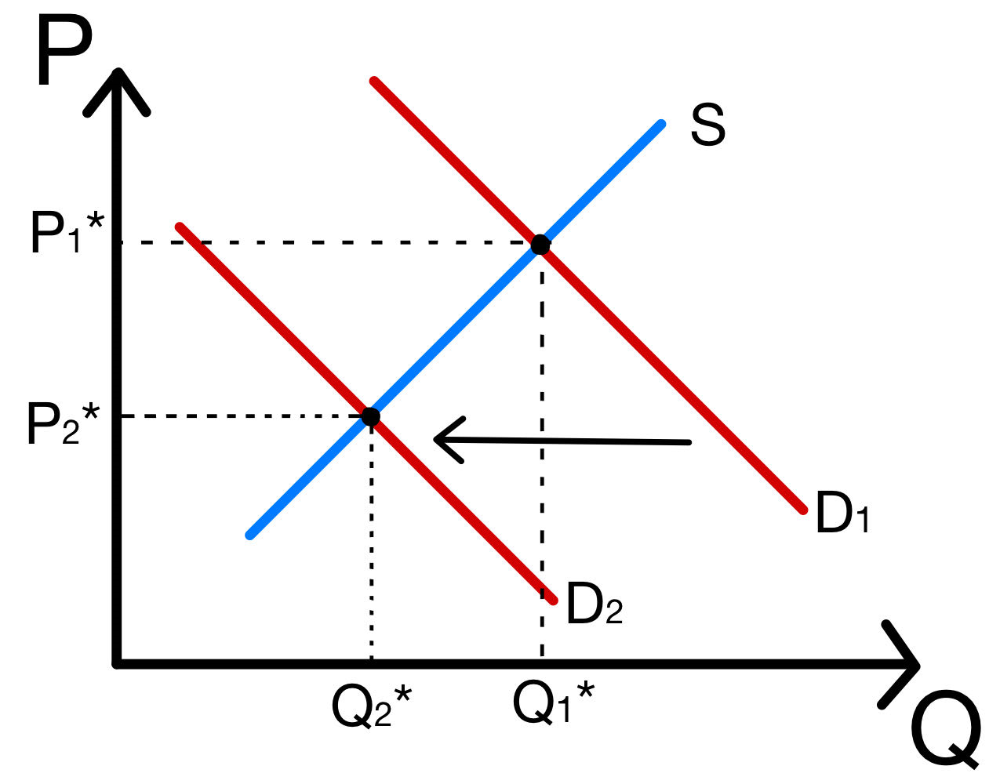
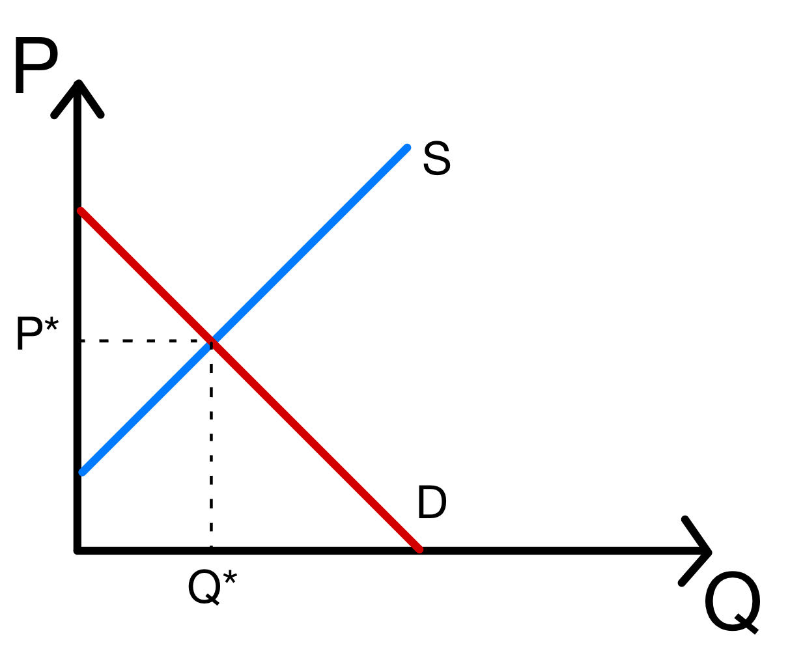
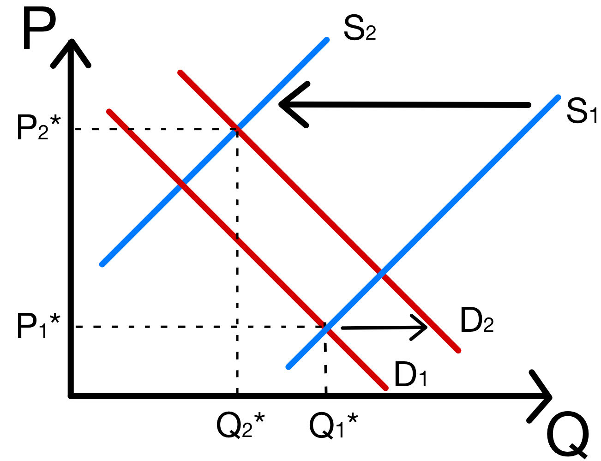
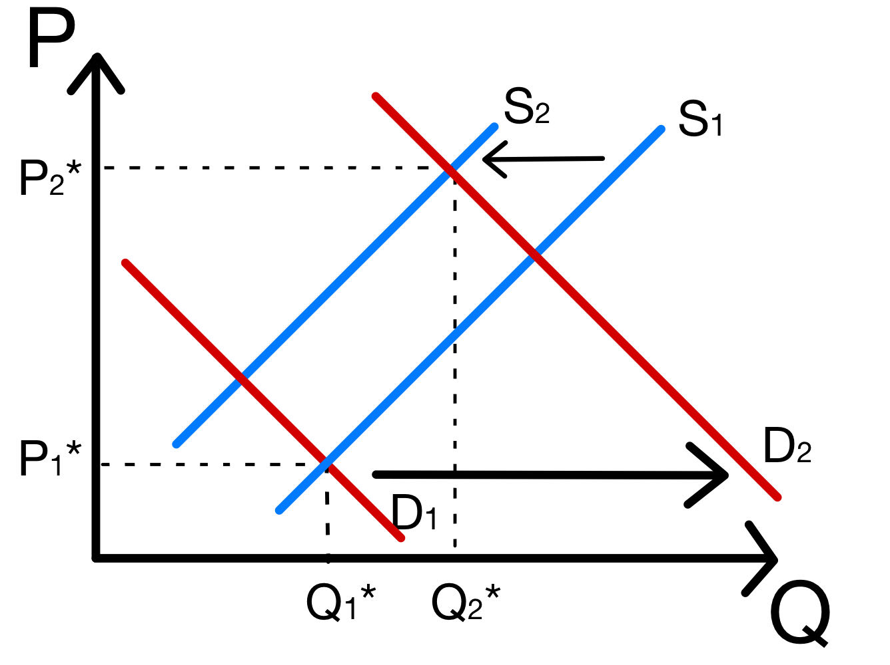

# 经济学原理第三次作业

梁昱桐 2100013116

## 供给与需求

**1、过去 30 年间，技术进步降低了手机芯片的成本。你认为这会对智能手机市场产生怎样的影响？对 SIM 卡呢？对 BB 机呢？ **

**注：本题中 BB 机一问是用来搞笑的，感兴趣的同学可以自行搜索了解一下 BB 机和手机行业的历史沿革。**

手机芯片作为智能手机的必要生产要素，成本降低后导致智能手机生产者在任意价格下能生产的商品增多，从而供给曲线右移，需求曲线不移动。智能手机市场均衡价格降低，均衡数量增加。

SIM卡和智能手机是互补品，智能手机价格降低，那么SIM卡的需求会增加，SIM卡的需求曲线不移动。SIM卡市场均衡价格和均衡数量均增加。

我认为在智能手机时代下，BB机早已退出历史舞台，BB机的交易市场中不再具有足够多的买方和卖方，从而谈论BB机市场没有意义。同时不会有人因为BB机很便宜就去买BB机，因此不能说智能手机和BB机是替代品。综上我认为BB机的买卖市场可能更偏向于古董或者时尚电子小垃圾的范畴，不会被智能手机所影响。

**2、近几年的社会调查表明，吸食毒品的年轻人增加了。在随后的争论中，人们提出了两种假设： **

​	**假设 A：警力的削减增加了年轻人在大街上得到毒品的可能性。 **

​	**假设 B：教育投入的削减降低了人们对吸毒危险性的认识。 **

**（1）用供需模型分别说明这两种假设会如何引起毒品消费量的增加。 **

假设A：警力的削减增加了年轻人在大街上得到毒品的可能性，使得大街上售卖毒品的毒贩子数量增加，卖者的数量上升，供给会增加，供给曲线右移，需求曲线不变。均衡价格降低，均衡数量增加。

假设B：教育投入的削减降低了人们对吸毒危险性的认识，使得更多的年轻人去购买毒品，买者的数量上升，需求增加，需求曲线右移，供给曲线不变。均衡价格增加，均衡数量增加。

**（2）如果我们知道毒品价格变动的信息，能否据此辨别哪个假设更加正确？**

能据此辨别哪个假设更加正确。

根据（1）问的分析，如果毒品价格上升，那么假设B正确；如果毒品价格下降，那么假设A正确。

**3、从 2022 年 5 月中开始，芝加哥商品交易所的大豆期货结算价格基本处于下跌 的态势。**

**【注：通过大豆期货合约，买卖双方约定在未来某一时间按照约定的价格进行大豆交易，这一约定的价格即为大豆期货结算价格；与期货价格相对，现货价格即为目前市场上大豆的价格】**

**为了分析的简便，我们假定大豆期货和现货 的价格完全相同。请使用供给与需求的标准图形判断并说明下列变化是否可以解释大豆价格的下跌。**

**（1）劳动力市场的改善增加了人们的收入，而大豆是正常品； **

由于人们的收入增加且大豆是正常品，人们的需求增加，需求曲线右移；供给曲线不变。从而大豆的均衡价格和均衡数量均上升，不能解释大豆价格的下跌。

**（2）养猪业的快速发展增加了大豆饼粕的需求； **

大豆饼粕的需求增加导致大豆的需求增加，需求曲线右移；供给曲线不变。从而大豆的均衡价格和均衡数量均上升，不能解释大豆价格的下跌。

**（3）4 月初大豆的高价减少了居民对大豆的需求； **

居民对大豆的需求降低，需求曲线左移，供给曲线不变。从而大豆的均衡价格和均衡数量均下降，可以解释大豆价格的下跌。

**（4）2022 年上半年的气候条件很适合大豆种植，大豆取得大丰收； **

大豆丰收，大豆的供给增加，供给曲线右移，需求曲线不变。从而大豆的价格降低，交易量上升，可以解释大豆价格的下跌。

**（5）研究表明豆浆对身体健康的益处被高估了，人们变得不再那么青睐豆浆。**

豆浆的需求降低，作为豆浆的原材料，大豆的需求也有所降低，需求曲线左移，供给曲线不变。从而大豆的价格和交易量均下降，可以解释大豆价格的下跌。

**4、在百京大学菁济学院，“鸡点”是一种十分受同学们欢迎的美食，为了购买 “鸡点”，同学们努力学习，取得收入，并且只消费“鸡点”这一种美食。2022 年，百京大学菁济学院共迎来了 100 位新同学。每位同学对“鸡点”的需求相 同且满足$P=10-20q$。“鸡点”由五位厨师邢小宇、王小嘉、张小航、田小晗和陈小婷生产，他们的供给相同且满足 $P=2+q$。** 

**（1） 请画出“鸡点”的供需曲线并求解均衡价格$P^*$ 和均衡数量$Q^*$。** 

$$
\left\{
\begin{aligned}
P&=10-20\times\frac{Q}{100}\\
P&=2+\frac{Q}{5}
\end{aligned}
\right.
\Rightarrow
\left\{
\begin{aligned}
P^*&=6\\
Q^*&=20
\end{aligned}
\right.
$$
**（2） 以下假定“鸡点”的供给不变，与（1）中相同。同学们通过勤奋努力地学习，掌握了许多菁济学知识，收入水平大幅度提升，每人对“鸡点”的 需求变为$P=12-20q$。请画出此时“鸡点”的供需曲线并求解均衡价格和均衡数量。**

$$
\left\{
\begin{aligned}
P&=12-20\times\frac{Q}{100}\\
P&=2+\frac{Q}{5}
\end{aligned}
\right.
\Rightarrow
\left\{
\begin{aligned}
P^*&=7\\
Q^*&=25
\end{aligned}
\right.
$$
**（3） 以下假定“鸡点”的需求与（1）中相同。厨师团队邀请了“鸡点”创始 人吴大腩分享经验，莅临指导。吴大腩不参与生产，但他的指导使得几位厨师生产技术大幅提高，每位厨师的供给变为 P=1+q。请画出此时“鸡 点”的供需曲线并求解均衡价格和均衡数量。** 

$$
\left\{
\begin{aligned}
P&=10-20\times\frac{Q}{100}\\
P&=1+\frac{Q}{5}
\end{aligned}
\right.
\Rightarrow
\left\{
\begin{aligned}
P^*&=5.5\\
Q^*&=22.5
\end{aligned}
\right.
$$
**光阴荏苒，时间飞逝，同学们即将迎来一年一度的购物节“期中考试节”。在这个盛大的节日，“鸡点”成为大家必不可少的美食。“鸡点”交易合法，同时具 有易于储存、不会变质的特点，可随时随地享用。当前你就可以预购下一个重大节日“期末考试节”的“鸡点”，厨师也可以随意调整“鸡点”的供给量。刚来 百京大学时，你的室友对你说，“如果可获得的`鸡点`数量减少，其价格将会上升，我们应该囤积‘期中考试节’时卖的‘鸡点’以供销售，这样就可以赚取大笔利润。”**

**【注：以下三问中不再涉及计算，只需作图。】** 

**（4） 如果这条信息是可以公开获得的，即“鸡点”市场上所有同学和厨师都 预期未来“鸡点”价格将上升，那么现在“鸡点”的需求与供给，以及均衡产出（价格与数量）将如何变动？** 

可以判断的是均衡价格一定上升，但是根据需求曲线和供给曲线的移动幅度，无法判断均衡数量的移动方向。

如果供给曲线移动幅度较大，那么均衡数量会下降；如果需求曲线移动幅度较大，那么均衡数量会上升。

**（5） 你能通过公开信息去“战胜市场”么？即你是否能够利用公开获得的信息去帮助你廉价地购买“鸡点”，并迅速以高价卖出？为什么？** 

不可以。

因为所有人都在追求最大利润，公开的信息会很快被利用，并如（4）中图像所示再次达到价值更高的均衡点。

并且总有人比你先得到公开信息，甚至在信息公开之前就会有人开始利用这个信息，信息差的存在导致我们不能利用公开信息战胜市场。

**（6） 因为沉迷微信游戏“羊了个羊”而主动辞职的“鸡点”厨师李小丁和其他厨师关系十分要好。有一天，他给你打电话，向你提供了吴大腩在“鸡点” 期中销售计划决策的内部信息：今年将减少“期中考试节”的“鸡点”供给。这是一条其他同学都不知晓的内幕，你能利用内部信息“战胜市场” 么？为什么?**

可以。

因为这个消息是非公开的，有足够的时间在价格较低的时候购入足够多的低价商品，在市场价格反映这个信息之前就提前囤积。

**5、非洲猪瘟是一种可怕的疾病，具有传染力强、破坏力大等特点。非洲猪瘟于 2018 年传入我国。在疫情公布后，猪肉价格有过短暂的下降；而在 2019 年，猪肉价格飞速上涨。请结合供需模型回答以下三个问题： **

**注：本题中引入以下四个假设： **

**（1）人们在知道疫情后，短时间内会害怕吃到病猪肉。 **

**（2）人们不会长期不吃猪肉，而猪出栏需要大半年时间。 **

**（3）猪肉进入售卖市场前，已经过严格屠宰检疫、生猪肉品品质检验。 **

**（4）其他条件不变**

**（1）疫情公布后，猪肉价格为什么会下降？ **

由假设（1），人们在知道疫情后，短时间内会害怕吃到病猪肉，从而人们的需求会减少，需求曲线左移；由于疫情刚刚传入的时候还影响不到已经出栏屠宰的猪，因此供给曲线不变。

这导致价格和交易量均下降。

**（2）2019 年，猪肉价格为什么会上涨？ **

由假设（2），人们不会长期不吃猪肉，并且由假设（3），人们现买到的猪肉很安全，于是人们恢复了对猪肉的需求，供给曲线相比（1）问右移。

然而由假设（2），猪出栏需要大半年时间，此时恰好是前一年猪瘟爆发时的猪出栏时间，那时许多猪死于猪瘟，因此现在猪肉供给不足，供给曲线左移。

这两个因素综合导致2019年猪肉价格飞速上涨。

**（3）由于 z 同学把生活费都拿来报名托福考试了，他发现自己吃不起猪肉了；z 同学决定把原先准备买猪肉吃的钱拿去买牛肉吃。不幸的是，z 同学发现牛肉价格也在显著上涨，因此他也吃不起牛肉，这个月只能吃青菜了。为什么 z 同学这个月只能吃青菜了？**

因为$z$同学没有猪肉和牛肉吃了。

首先是由于$z$同学把生活费都拿来报名托福考试，所以他吃不起价格飞速上涨的猪肉了。

其次由于猪肉和牛肉是替代品，市场上猪肉价格上涨，导致牛肉需求增加，牛肉的需求曲线右移，牛肉的供给曲线不变，从而牛肉价格也上涨，因此他也吃不起牛肉了。
