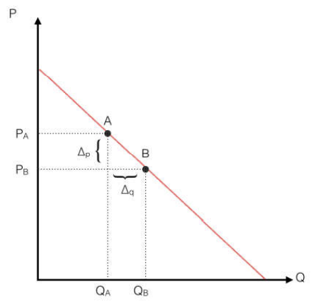
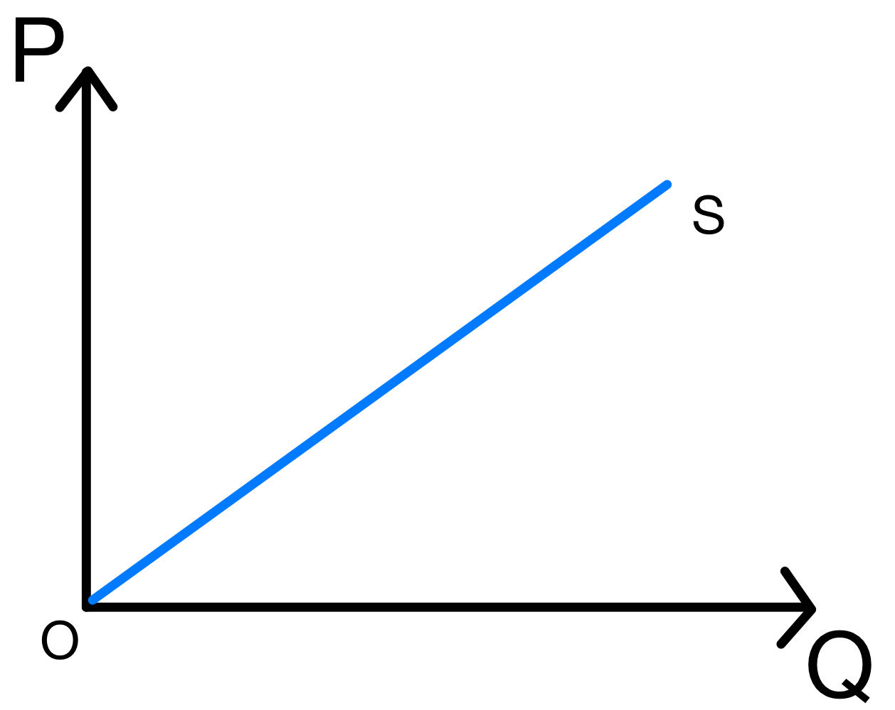
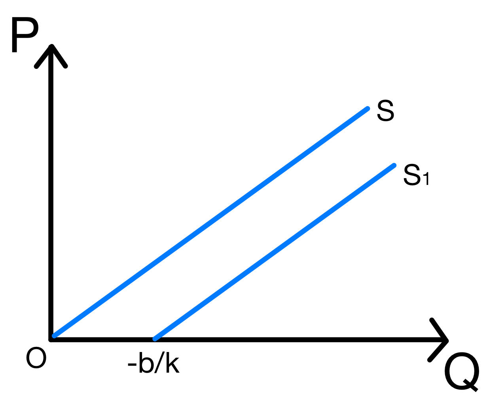
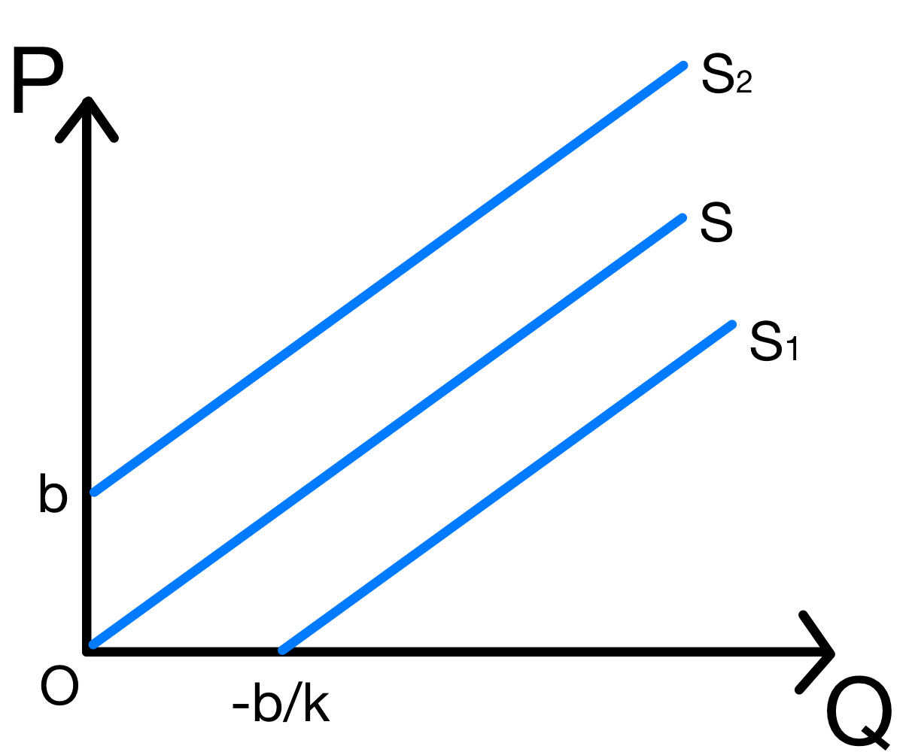
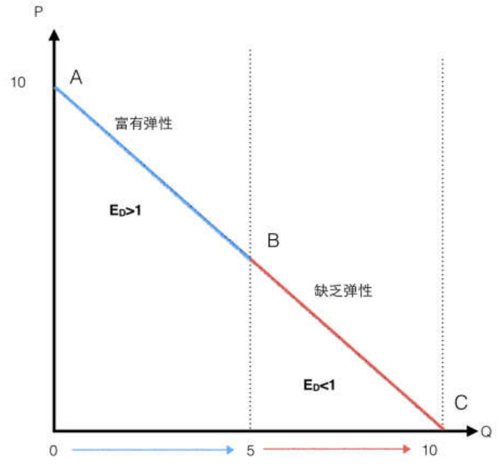

# 经济学原理第四次作业

梁昱桐 2100013116

## 弹性

**1. 如果你总愿意把你收入（尽管你可能没有任何收入）的 80%用于给室友改善伙食，那么对于你来说，为室友改善伙食这件事情的需求收入弹性为：**

**a. 0.40**

**b. 0.80**

**c. 1.00**

**d. 1.20**

**e. 以上均错误，正确答案是______________**

Answer: c.
$$
E_D=\frac{\Delta_q/Q}{\Delta_p/P}=\frac{(\Delta_p\times80\%)/(P\times80\%)}{\Delta_p/P}=1.00
$$
**2. 已知德云社一场相声演出的门票价格为 $P_A$ 时，需求量是 $Q_A$ ；价格为 $P_B$ 时， 需求量是 $Q_B$ ，假设 $P_A>P_B$ **

**a) 请用中点法算出从 $A$ 到 $B$ 的价格弹性 $E_{AB}$ **
$$
\begin{aligned}
E_{AB}&=\frac{Q_B-Q_A}{P_A-P_B}\times\frac{(P_A+P_B)/2}{(Q_A+Q_B)/2}\\
&=\frac{(P_A+P_B)\Delta_q}{(Q_A+Q_B)\Delta_p}
\end{aligned}
$$

**b) 假定  $E_{AB}<1$  ，那么当销售从 $A$ 点移动到 $B$ 点时（尽管剧场可能会坐不下，但允许卖吊票），卖票的总收益会发生什么变化？请证明你的结论**

买票的总收益会下降
$$
\begin{aligned}
E_{AB}<1&\Rightarrow\frac{Q_B-Q_A}{P_A-P_B}\times\frac{(P_A+P_B)/2}{(Q_A+Q_B)/2}<1\\
&\Rightarrow\frac{P_A+P_B}{Q_A+Q_B}<\frac{P_A-P_B}{Q_B-Q_A}\\
&\Rightarrow P_BQ_B<P_AQ_A
\end{aligned}
$$

$$
\begin{aligned}
\Delta T_R&=P_BQ_B-P_AQ_A\\
&<0
\end{aligned}
$$

**c) 假定  $E_{AB}=1$  ，那么当销售从 $A$ 点移动到 $B$ 点时，卖票的总收益会发生什么变化？请证明你的结论** 

买票的总收益不变
$$
\begin{aligned}
E_{AB}=1&\Rightarrow\frac{Q_B-Q_A}{P_A-P_B}\times\frac{(P_A+P_B)/2}{(Q_A+Q_B)/2}=1\\
&\Rightarrow\frac{P_A+P_B}{Q_A+Q_B}=\frac{P_A-P_B}{Q_B-Q_A}\\
&\Rightarrow P_BQ_B=P_AQ_A
\end{aligned}
$$

$$
\begin{aligned}
\Delta T_R&=P_BQ_B-P_AQ_A\\
&=0
\end{aligned}
$$

**d) 以下我们用两点间需求弹性的定义计算弹性（即用中点法进行修正之前）。请计算从 $A$ 点到 $B$ 点的弹性 $E^{'}_{AB}$** 
$$
\begin{aligned}
E_{AB}^{'}&=\frac{Q_B-Q_A}{P_A-P_B}\times\frac{P_A}{Q_A}\\
&=\frac{P_A\Delta_q}{Q_A\Delta_p}
\end{aligned}
$$

**e) 通过与郭德纲和于谦聊天你得知：当销售从 $A$ 点移动到 $B$ 点时，卖票的总收益没有发生任何变动。那么你认为此时从 A 到 B 的需求弹性 $E^{'}_{AB}$ 应该是多少？请通过计算确认（或否定）你的想法**

 $E^{'}_{AB}=\frac{(P_A+P_B)\Delta_q}{(Q_A+Q_B)\Delta_p}=1$，根据需求弹性的经济学含义，弹性衡量了需求量对价格的反应程度，由于价格变化后总收益不变，那么可以得出销售从 $A$ 点移动到 $B$ 点的需求弹性 $E^{'}_{AB}$ 应该是 $1$ ，这与 c) 问的计算结果相符，可以认为此时$E^{'}_{AB}=\frac{(P_A+P_B)\Delta_q}{(Q_A+Q_B)\Delta_p}$

现在考虑 d) 问的弹性：
$$
\begin{aligned}
E^{'}_{AB}=1&\Rightarrow\frac{Q_B-Q_A}{P_A-P_B}\times\frac{P_A}{Q_A}=1\\
&\Rightarrow2P_AQ_A=P_AQ_B+P_BQ_A
\end{aligned}
$$
不能推出 $\Delta T_R=P_BQ_B-P_AQ_A$ 为 $0$ ，因此 d) 问的弹性不够精确

**3. 假设学五食堂的鸡腿饭供应遵循线性的供给函数 $P=k\times Q+b$ （由于供给曲线向右上方倾斜，我们知道 $k>0$）**

**a) 假定 $b=0$ ，试证明供给函数的弹性 $E_S$ 处处为 $1$。请在图上画出 $b=0$ 时的供给函数，并用弹性的定义解释你的结果**

$$
\begin{aligned}
E_{S}&=\frac{P\Delta_q}{Q\Delta_p}\\
&=\frac{kQ\Delta_q}{Qk\Delta_q}\\
&=1
\end{aligned}
$$
供给弹性的经济学意义是一个物品的供给量对价格变动的反应程度，定义是供给量变动的百分数比价格变动的百分数的比值，如果某种物品的供给量和其价格成正比，那么很显然供给量变动百分之多少则价格变动百分之多少，于是供给弹性为 $1$

**b) 假定 $b<0$ ，供给弹性会发生什么变化？请在<u>同一张图上</u>画出 $b<0$ 时的供给函数，并用弹性的定义解释你的结果**

$$
\begin{aligned}
E_{S}&=\frac{P\Delta_q}{Q\Delta_p}\\
&=\frac{(kQ+b)\Delta_q}{Qk\Delta_q}\\
&=1+\frac{b/k}{Q}
\end{aligned}
$$
 $b<0$ ，那么 $E_S<1$ ，这说明供给量变动的百分数要小于价格变动的百分数，供给量对市场价格的变化是不敏感的

**c) 假定 $b>0$ ，供给弹性会发生什么变化？请在<u>同一张图上</u>画出 $b>0$ 时的供给函数，并用弹性的定义解释你的结果**

$$
\begin{aligned}
E_{S}&=\frac{P\Delta_q}{Q\Delta_p}\\
&=\frac{(kQ+b)\Delta_q}{Qk\Delta_q}\\
&=1+\frac{b/k}{Q}
\end{aligned}
$$
 $b>0$ ，那么 $E_S>1$ ，这说明供给量变动的百分数要大于价格变动的百分数，供给量对市场价格的变化是敏感的

**4. 莱布尼茨：“线性的需求函数上不存在两个需求价格弹性完全相同的点（即每一处的需求价格弹性均不同）。假定`东方树叶`的需求曲线的表达式为： $P=b-k\times Q$ ，其中 $b>0$ ，$k>0$ **

**a) 总的来说，在需求曲线的上半段，需求富有弹性；而在需求曲线的下半段，需求缺乏弹性。你认为弹性随着`东方树叶`价格不断降低 （即需求量的不断增加）会发生怎样的变动？请证明你的结论** 

需求弹性是持续下降的

不妨假设需求曲线的自变量为需求量

并且假设需求曲线和其弹性具有良好的性质，也即需求弹性函数是需求量的连续的函数，此时需求弹性的极限等于右极限，因此可以使用未修正的弹性公式
$$
\begin{aligned}
E_D(Q_0)&=\underset{Q\to Q^+_0}{\lim}\frac{Q-Q_0}{P_0-P}\times\frac{P_0}{Q_0}\\
&=\underset{Q\to Q^+_0}{\lim}\frac{Q-Q_0}{(b-k\times Q_0)-(b-k\times Q)}\times\frac{P_0}{Q_0}\\
&=\frac{P_0}{kQ_0}
\end{aligned}
$$
$Thus:$
$$
\begin{aligned}
E_D(Q)&=\frac{P}{kQ}\\
&=\frac{b-kQ}{kQ}\\
&=\frac{b/k}{Q}-1
\end{aligned}
$$
函数 $E_D(Q)$ 是 $Q$ 的减函数，因此需求弹性随着需求量的不断增加会下降

**b) 在`东方树叶`需求曲线上存在使弹性为 $1$ 的点么？如果存在，请计算出该点对应的`东方树叶`的价格和需求量**

存在

根据上一问结论：
$$
\left\{
\begin{aligned}
P_0&=b-kQ_0\\
E_D&=\frac{b/k}{Q_0}-1\\
E_D&=1
\end{aligned}
\right.
\Rightarrow
(Q_0,\ P_0)=(\frac{b}{2k},\ \frac{b}{2})
$$
`东方树叶`的价格为 $\frac{b}{2}$ ，需求量为 $\frac{b}{2k}$ 时弹性为1
