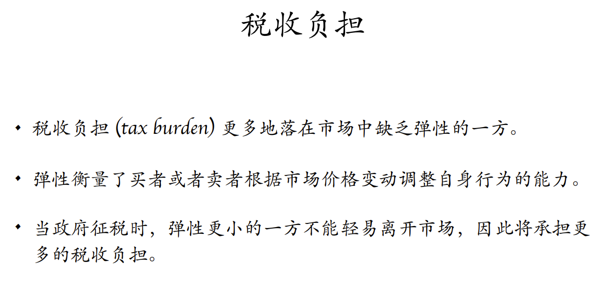

# 经济学原理（1）课堂笔记

## 第一次课 2022年9月6日

### 机会成本$(opportunity\ cost)$

* 机会成本$(opportunity\ cost)$$=货币成本（显性成本，$$explict\ cost$$）+时间成本（隐性成本，$$implict\ cost$$）

### 生产可能性边界$(production\ possibility\ frontier)$

### 人们会对激励做出反应

* 欧洲国家器官捐献率

### 理性人考虑边际

* 理性人追求自身利益的最大化 $(Payoff\ Maximization)$

* 结论：理性人考虑最小的增量

## 第二次课 2022年9月13日

### 如何满足自身需求？

* 自给自足

* 与他人贸易

### 贸易双方是否双赢？

* 显示性偏好$(Revealed\ Preference)$：消费者的购买行为暴露或显示了其内在的偏好倾向

* 一个简单的从结果开始的证明，在贸易发生的前提下：
  * 基本观察：贸易是自发的
  * 若贸易使一方受损$\ \Rightarrow\ $受损的一方不会同意交易$\ \Rightarrow\ $交易不会发生！

* 然而，这不能解释：
  * 贸易是否必然发生？
  * 贸易如何使双方变得更好？
  * 贸易为何发生？
  * 贸易中的价格如何产生？

* 因此试图找一个新的模型，好的模型应该可以回答三个问题：
  * 如果不允许贸易，双方各自如何生产和消费？
  * 如果允许贸易，贸易前双方如何生产？
  * 如果允许贸易，贸易后双方如何消费？

### 绝对优势和比较优势

* 绝对优势$(Absolute\ Advantage)$：
  * 若厂商在生产单位$$x$$时投入的要素较少，那么其在生产$$x$$的时候具有绝对优势
  * 绝对优势描述一个人、公司、国家相对其它人、公司、国家的生产率
  * 基本观察：**厂商可能对其生产的所有产品均具有绝对优势**

* 比较优势$(Comparative\ Advantage)$:
  * 若厂商在生产单位$$x$$时的机会成本较小，那么其在生产$$x$$的时候具有比较优势
  * 基本观察：**厂商不可能对其生产的所有产品均具有比较优势**

### 李嘉图模型

* 有效的联合生产：不止意味着用光资源，还意味着正确的人生产了正确的产品
  * 给定$$x$$，最多生产的$$y$$，能够更有效地利用时间
  * 最优生产计划：给定一定数量的$x$，让生产$x$**机会成本更低**的人先生产

* 联合生产可能性边界$(Joint\ PPF)$
  * 机会成本的差别为人们从贸易中受益创造了条件
  * 专业化使经济总产量增加：$C>A+B$
  * 只要不是两个人只生产一种东西，那么经济总产量增加不依赖于生产者的消费偏好

* 消费可能性边界$(Consumption\ Possibility\ Frontier,\ CPF)$
  * 消费者可能消费的最大组合
  * 边界的斜率刻画了$$x$$的市场价格
  * 过低或者过高的$$x$$价格都会导致市场只有一种商品，因此**为了使贸易发生，交易价格应当在两个人的机会成本之间**；如果有多个人，交易价格应当在最低的机会成本和最高的机会成本之间

### 李嘉图模型告诉我们

* 当每个人更多地生产各自具有比较优势的产品时，经济总量将会增加

* 由于人们会对价格做出反应，因此：
  * 给定市场价格，基于自身利益的考量，人们会在生产前调整各自的生产计划
  * 然而，这种基于个体利益最大化的生产，却在整体上实现了联合生产的效果
  * 因此，总体经济将更有效地利用资源进行生产
  * 在生产完成后，人们依据市场价格自愿地贸易，消费原先各自生产可能性边界无法企及的消费组合

### 李嘉图模型没有告诉我们

* 我们**不知道交易价格是如何形成的**，我们仅仅知道市场价格可以有效地配置资源
  * 可能性1：单个买家和卖家之间的讨价还价$\ \Rightarrow\ $议价模型$(Bargaining\ Model)$
  * 可能性2：市场的力量$\ \Rightarrow\ $供需模型$(Supply\ and\ Demand\ Analysis)$

## 第三次课 2022年9月20日

### 市场$(Market)$

* 供需模型
* 买房决定需求$(demand)$
* 卖方决定供给$(supply)$
* 买卖双方共同决定市场结果
  * 价格$(price)$
  * 数量$(quantity)$

### 需求和需求量$(Demand\ and\ Quantity\ Demanded)$

* 需求量$(Quantity\ Demanded)$：消费者在**给定**的价格下**愿意且能够购买**的商品数量。
* 需求$(Demand)$：消费者在**各个**可能的价格下**愿意且能够购买**的商品数量**（是一个函数）**
* 需求定律$(The\ law\ of\ demand)$：**其它条件不变（只有价格变化）**，价格上升导致需求量下降（比如房子将来涨价，此时其它条件改变）（不能决定需求曲线的形状）
  * Question: 为什么贵了买的少了？（解释起来不那么显然，期中之后再考虑）
* 个人需求与市场需求：市场需求是个人需求在每个价格下的**水平**加总。（因为把价格放在$Y$轴）
  * 隐含假设：竞争是充分的，否则无法保证对每个人来说价格一样。
  * 

* 需求量的变化：由该产品价格的变动所引起。
  * **沿着需求曲线移动**
  * 
* 需求的变化：由该产品价格以外的变化所引起。
  * **整条曲线发生移动，向外或向里。**
  * 
  * 影响需求的因素$x$：通过$x$的变化能够判断该商品的性质
    * **消费者收入**$(Consumer\ income)$：政府的管控也可以通过影响收入而改变需求
      * 定义1：若产品的需求随着收入的增加而增加，我们称其为**正常品**$(normal\ good)$，**需求曲线右移（不是上移）**
      * 定义2：若产品的需求随着收入的增加而减少，我们称其为**低档品**$(inferior\ good)$，需求曲线左移
    * **相关产品的价格**$(Price\ of\ relatd\ goods)$：香蕉价格的变化改变了对苹果的需求
      * 定义1：若产品的需求随着另一种产品价格的增加而增加，我们称这两种产品为**替代品**$(substitutes)$，需求曲线右移
      * 定义2：若产品的需求随着另一种产品价格的增加而减少，我们称这两种产品为**互补品**$(complements)$，需求曲线左移
    * 预期$(Expectation)$
    * 买者的数量$(Number\ of\ consumers)$

### 供给和供给量$(Supply\ and\ Quantity\ Supplied)$：基本类似需求与需求量

* 影响供给的因素
  * 要素价格$(Input\ Prices)$
    * 技术进步，需求曲线向右移动
  * 技术
  * 预期
  * 卖者的数量

### 市场均衡$(Market\ Equilibrium)$

* 均衡价格$(Equilibrium\ Price)$
* 均衡数量$(Equilibrium\ Quantity)$
* 均衡价格有时在文献中会被称为市场出清价格$(market-clearing\ price)$，在这种价格下，市场下**每一个人**都得到满足
* 市场为何趋向均衡？
  * 考虑偏移均衡的时候，市场会如何进行调整？**（需要大量的生产者和消费者）**
  * 
  * 
* 供需定理：自由市场上，任何一种物品价格的调整都会使其供给量和需求量相等
* 价格机制的背后
  * 隐含的重要假设：充分竞争，无人拥有市场势力$(market\ power)$
  * 买卖双方均为价格接受者$(price taker)$
  * 市场中存在许多消费者和生产者
  * 产品完全同质$(homogeneous\ good)$
* 均衡分析的不足
  * 供需模型刻画的是竞争市场长时间下的稳态，然而市场价格是不断波动的
  * 两种解决方案：
    * 摈弃现有的分析，建立一个动态的框架
    * **对现有模型进行拓展，通过静态理解动态**

### 比较静态分析$(Comparative\ Static)$：研究价格变动的工具

* 比较静态分析考虑模型中外生变量的变化对内生变量带来的影响
  * 
  * 
* 三个简单的步骤
  * 
* 几个例子：
  * 需求增加如何影响均衡
  * 供给减少如何影响均衡

### 边际与供需

* 需求曲线
  * 
  * 边际收益曲线$(marginal\ benefit)$：社会多生产一单位带来的总效益的变化。
  * 需求曲线$=$边际收益曲线     $D=MB$
  * 随着收入的增加，每个边际买家对商品的支付意愿也增加$\Rightarrow$需求（边际收益）曲线**向上**移动！
* 供给曲线
  * 
  * 边际成本曲线$(marginal\ cost)$：社会多生产一单位带来的总成本的变化。
  * 供给曲线$=$边际成本曲线     $Supply\ Curve=Marginal\ Cost\ Curve$
  * 随着技术的革新，社会生产最后一单位产品的成本降低$\Rightarrow$供给（边际成本）曲线**向下**移动！

## 第四次课 2022年9月27日

### 弹性$(Elasticity)$

* 

* 

* $$
  f(p,q)=0\\
  E_D=\abs{\frac{pf_p}{qf_q}}
  $$

* 厂商喜欢需求弹性小的消费者
  * 当消费者对价格极度敏感时，个体厂商完全失去了定价能力（市场势力），企业是价格接受者$(price\ taker)$
  * 当需求曲线向右下方倾斜的时候，厂商拥有一定的定价能力（市场势力），企业是价格制定者$(price\ maker)$
  
* 完全竞争下
  * 个体卖家不具有市场势力

### 需求价格弹性的决定因素

* 相近替代品的可获得性
  * 人造黄油、鸡蛋：人造黄油需求价格弹性更大
* 必需品还是奢侈品
  * 游艇、骨折看病：游艇弹性大
* 时间长短
  * 汽油的长期需求、短期需求：长期需求弹性大，可以替代（电动车）
* 市场的界定
  * 冰淇淋、香草冰淇淋：香草冰淇淋弹性更大，有替代品

### 应用一：弹性与均衡分析

* 
  * 农民整体变得更差了，但是可能产生了农场主，他们更好了；被挤出市场的农民更差了
* 限量版邮票：两套烧掉一套

### 其它弹性

* 供给弹性

  * 
  * 没有绝对值，**只要供给曲线为直线且过原点，供给价格弹性处处为一**
  * 
  * 

* 需求收入弹性

  * 

* 需求交叉弹性

  * ​	

  

## 第五次课 2022年10月4日

### 市场与政策

* 价格控制 $(Price\ Control)$ 
  * 价格上限
    * 
    * 
    * 
    * 原油禁运
      * 
    * 租房控制
  * 价格下限
    * 
    * 最低工资
      * 
      * 理论预测：提高最低工资增加失业
      * 实证结果：促进就业，劳动力需求市场竞争不重复
    * 欧洲农产品
  * 
* 数量控制
  * 
  * 
  * 牌照
* 税收及补贴
  * 
  * 
  * 
  * 
  * 
  * 

# 第六次课 2022年10月11日

**市场不存在一个最优的价格，但存在一个最优的交易量**

